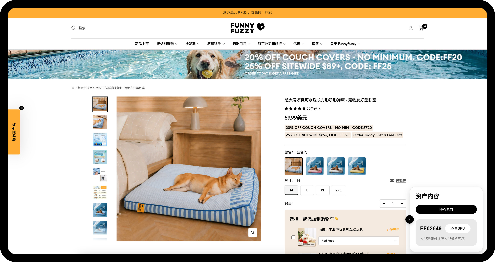
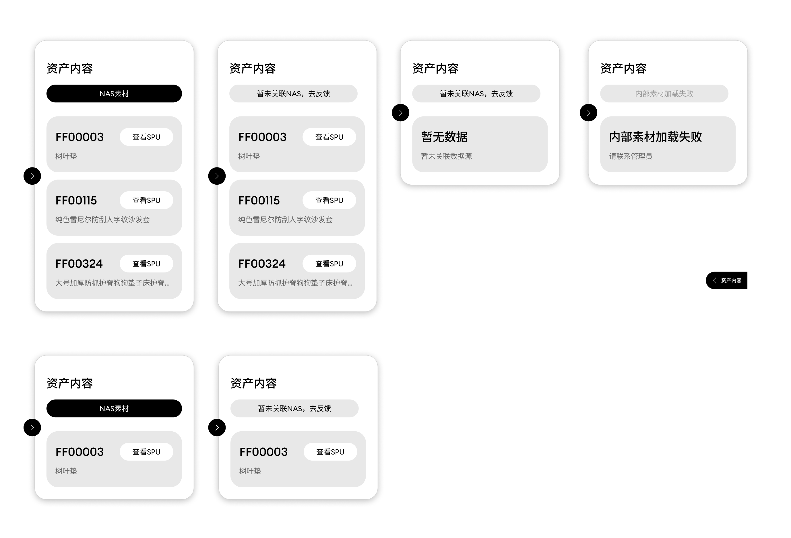

# FunnyFuzzy Product Assets Extension

A Chrome extension and lightweight internal query service that helps merchandising, design, and photography teams jump from a FunnyFuzzy product page to the right SPU record and NAS asset folders in one step.



## Overview

This project started from a simple internal request: add an SPU identifier to the product page so teammates could search for assets faster.

Instead of exposing internal operations data on the storefront, the final solution became a right-side internal-only extension panel. The panel recognizes the current product page, queries a maintained Feishu binding table, and returns:

- linked image asset folders
- linked video asset folders
- SPU information
- a direct entry to the SPU sheet
- a feedback path when NAS links are still missing

The result is a much shorter path from product page to production assets, without changing the customer-facing shopping experience.

## Who It Helps

- Merchandising teams looking up product materials during listing work
- Designers collecting the correct source folders quickly
- Photography teams needing direct access to image and video assets
- Internal maintainers who need clearer error states and feedback routes

## What Was Built

- A floating panel injected into FunnyFuzzy product pages
- A local/internal service that reads Feishu binding data
- Cross-platform NAS path handling for macOS and Windows
- Support for one product page mapping to multiple SPUs
- Support for one SPU mapping to multiple NAS links
- Separate image and video asset buttons from a single `nas_material_url` field
- Explicit states for bound, unbound, loading, error, and collapsed UI

## From Requirement to Solution

### 1. Initial Request

The original idea was to place an SPU code directly on the product page so internal teammates could copy it and search manually.

### 2. Product Decision

SPU is useful for internal workflows, but it should not appear in the storefront UI.  
So the direction shifted from “add a visible field” to “build an internal-only tool layer”.

### 3. Final Workflow

The extension now works like this:

1. Detect the current FunnyFuzzy product page
2. Query the Feishu binding table through the local service
3. Match the product URL or fallback product slug
4. Render the related SPU and asset actions inside a collapsible panel
5. Open NAS folders or SPU sheet without leaving the product workflow


## UI Evolution

### Early UI

The earlier version focused on proving the workflow and main actions first.


### Final UI

The shipped version refined the panel states and made asset categories clearer:

- black button for image assets
- blue button for video assets
- gray button for feedback when NAS is not linked



## Asset Link Rules

The extension reads NAS links from one field: `nas_material_url`.

- Plain path: treated as an image asset
- `video:` prefix: treated as a video asset

Example:

```text
'/Volumes/company/project/product/image-folder'
video:'/Volumes/company/project/product/video-folder'
'/Volumes/.../image-folder-1','/Volumes/.../image-folder-2',video:'/Volumes/.../video-folder-1'
```

This lets the team keep one maintenance field while still separating image and video workflows in the UI.

## Tech Structure

- `FFweb2NAS/`: Chrome extension
- `service/`: internal query service
- `scripts/`: build, package, and data-cleaning scripts
- `docs/`: maintenance notes and field rules

## Local Development

Install dependencies:

```bash
npm install
```

Run tests:

```bash
npm test
```

Build the extension:

```bash
npm run build:extension
```

Package a release build:

```bash
npm run package:extension
```

Start the local service:

```bash
npm run service:start
```

## Load the Extension in Chrome

1. Open `chrome://extensions`
2. Enable Developer Mode
3. Click `Load unpacked`
4. Select the `FFweb2NAS` folder

## My Contribution

- Reframed the requirement from “show SPU on page” to an internal plugin workflow
- Defined the product-side interaction and status design
- Structured the maintenance flow around Feishu + NAS + SPU lookup
- Iterated the panel states for real internal use
- Used AI assistance to speed up workflow design, validation, and implementation refinement

## Notes

- Environment variables stay local in `.env` and are not committed
- Release packages are generated locally and are not committed
- Internal deployment values should be configured per environment
